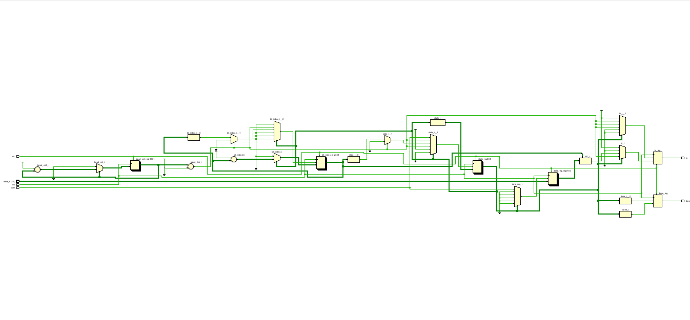
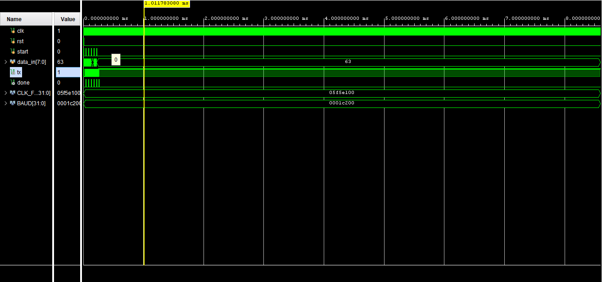
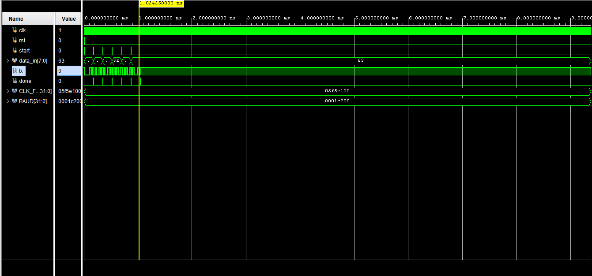
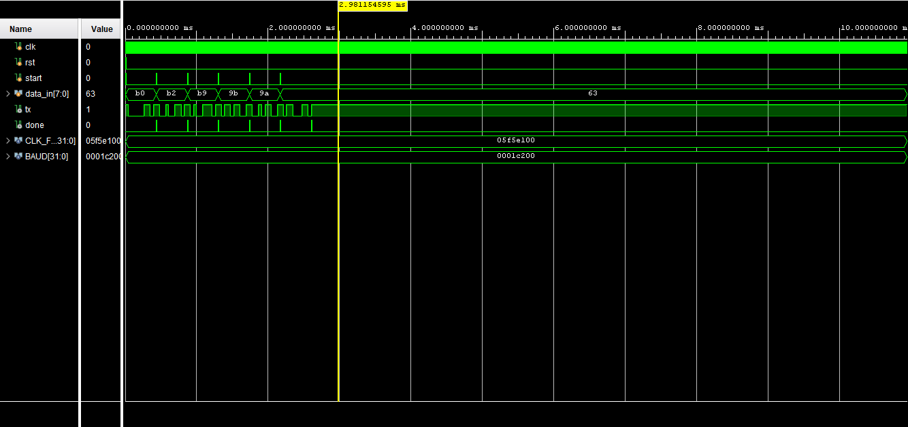
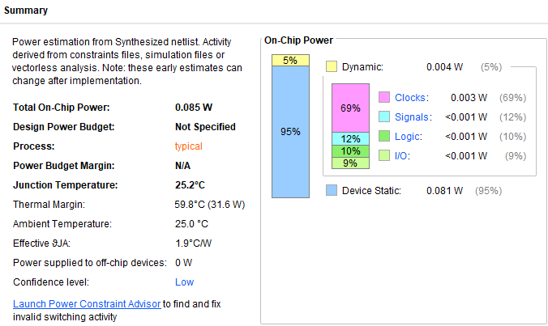

 UART-Tramsmitter
UART transmitter in Verilog using FSM design with baud rate generator, handling start, data, and stop bits for serial communication. Parameterized for clock and baud rate, and verified using testbench with 5ns, 20ns, and 50ns clock periods to analyze timing behavior across different speeds.
# UART Transmitter using Verilog

## Description
This project implements a UART transmitter using Verilog HDL. It converts parallel data into serial format using start, data, and stop bits with a baud rate generator.

## Design Overview
- Input: 8-bit parallel data
- Output: Serial TX line
- Features:
  - Baud rate generator
  - Start bit, data bits, stop bit
  - FSM-based control

## Folder Structure
- rtl/ → UART design code  
- testbench/ → Simulation files  
- netlist/ → Synthesized output  
- docs/ → Waveforms & schematic  

## Tools Used
- Xilinx Vivado  
- Verilog HDL  

## Results

## Schematic

## Simulation Waveform

## Power Analysis

## How to Run
1. Open in Vivado  
2. Add RTL & testbench  
3. Run simulation  
4. Run synthesis  

## Author
Gwta Umakanth
